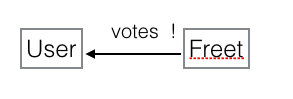
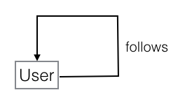
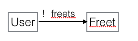

# A3 Reflection

**Meryl Wang**

## Concept Design Models

<u>Concept</u>: **Upvoting**

<u>Purpose</u>: Allow users to give & see popularity of posts / allow posts to have popularity

<u>Structure</u>: 

​	votes : one Freet -> User

​	constraint: an user can increment a post's votes by <= 1. 

​	note : user can upvote own freet. 

<u>Behaviors</u>:

​	upvote ( u : User, f : Freet ): u not in f.votes => votes += f -> u

​	undo_upvote( u : User, f : Freet ) : u in f.votes =>  votes -= f -> u

​	count_votes ( f : Freet ) : return |f.votes|

<u>Tactics</u>: 

​	upvote( u, f ); ... undo_upvote( u, f ); ... count_votes( f );

<u>Concept</u>: **Following**

<u>Purpose</u>: Allow user to see posts from other selected users / allow user to curate their own feed

<u>Structure</u>: 

​	

​	follows : User -> User

 - one user can follow multiple other users

 - one user can be followed by multiple other users

 - user can unfollow & be unfollowed

<u>Behaviors</u>: 

​	follow ( u1 : User, u2 : User ):  follows += u1 -> u2 // u1 follows u2

​	unfollow ( u1 : User, u2 : User ) : follows -= u1 -> u2

​	view_feed ( u1 : User ) : {return u2.freets for all u2 : u1.follows } // view freets of u's following

<u>Tactics</u>: 

​	follow( u1, u2 ); ... unfollow( u1, u2 ); ... view_feed( u1 );

<u>Concept</u>: **Refreeting**

<u>Purpose</u>: Allow a post to be spread to users other than author's followers / increase visibility & accessibility of post 

<u>Structure</u>: 

​	

​	freets : one user -> freets

​	constraints : 

		- user cannot refreet freets they authored
		- use cannot refreet a freet more than once 
		- if original author deletes freet, the refreet(s) will disappear or fail

<u>Behaviors</u>: 

​	refreet ( u : user, f : Freet ) : f not in u.freets =>  freets += u -> f

​	view_wall ( u : User ) : { return u.freets } 

<u>Tactics</u> :

​	refreet ( u, f ); ... view_my_freets ( u.freets );

​	

## Design Choices

<u>Undo Upvote vs. Downvote</u>

For *upvote*, I considered whether to allow users to `downvote` a freet, which differs from a simple `undo` of an upvote. I decided against it due to the purpose of Fritter. 

For example, YouTube allows both `like` and `dislike` whereas social media like Facebook and Instagram only has `like`. The user may undo the `like`, but they cannot `dislike`. 

I think this is because YouTube priorizes the curation and quality of content, while social media prioritizes user & user experience. Allowing `dislike` in social media may potentially hurt users ego and discourage posting. Hence, given that Fritter is a social media application, I decided to do ignore `dislike`. 

<u>To return error or not to return error</u>

Whether to 'catch' repeat actions such as repeating upvotes, undos, followings, unfollowings, refreetings: Since these relations are stored as sets, repeated actions would simply go unnoticed because sets store unique values. So I could let the user click on upvote for a freet without returning an error code. However I decided to return an error anyways as a catch, in case the user ever wonders why the upvote isn't increasing the vote count when they click on it. 

<u>Following oneself</u>

Should an user be able to follow themself? For my design, I said yes. This is because I separated the concepts of `feed` and `wall`. `feed` is a payload of  `follow`  that lets user see a collection of freets from users they follow, and `wall` is simply the collection of the user's own freets (the freets they authored & refreeted.) Hence, it is reasonable for the user to be able to follow themself to see their own freets in their feed. 

<u>You refreeted a freet, but the author deleted it?</u>

For *refreet*, I copy a freet reference (freet id) to the user's data instead of copy-pasting the entire freet over to the refreeting user. Upon viewing the feed, Fritter will obtain the relevant freet data based on the reference in real time. This decision 1) takes some load of storing as a freet is stored once no matter how many times it is refreeted and  2) allows original author to always have control over the freet. That is, if the author  edits / deletes the freet, the refreets will reflect this change. 

<u>Should Refreets be separate from regular freets</u>

Also for *refreet*, an alternative I considered is to make the model *Refreets* a subset of *Freets*, and save refreeted freets as a relation between User -> Refreets. However, I arrived at my current design because I decided this is redundant. Given my design decisions that an user cannot refreet 1) freets he authored and 2) freets he has already refreeted, it is actually simpler to keep the authored and refreeted freets in one set so there only needs to be one check instead of two. Additionally, my Freet model stores author information,  so I do not need to keep refreets in another set to know that they are refreets: I could simply check the author information stored inside the freet. 

## Ethical Implications

**upvote**

Upvoting essentially allows users at mass to rate quality / give popularity to a post. This itself has little implications (I think) but it's what Fritter can do with this information that is the question. 

For example, Fritter can order freets on an user's feed such that the most popular freets are placed first (as opposed to an unbiased, chronological order). This may help users find enjoyable content faster but at the cost of assuming that all users think alike, e.g. that the individual user is likely to enjoy content enjoyed by everyone. This may discourage critical thinking from the individual as they are trained to like the content that others have liked. 

The presense of post's popularity itself may also bias user's preference. That is, whereas without the votes information, an user can objectively decide how much they like the post, when the information is there, the user is likely to subconsiouly agree with the data. This phenonon is demonstrated in the [Solomon Acsh Conformity Experiment](https://www.simplypsychology.org/asch-conformity.html), where a number of test subjects "conformed with the clearly incorrect majority". Or, as another experiment indicates, “[People] don’t share information, they share biases" ([Why People Get More Stupid in a Crowd](http://www.bbc.com/future/story/20160113-are-your-opinions-really-your-own)).

**follow**

With current design, any user can be followed by any other user & have his contents viewed by these followers, which means the user does not have the ability to curate his own audience. The user essentially has no privacy. 

A future improvement is to let potential followers submit following requests to the user, and they cannot view the user's content until he approves the request. 

**refreet**

With my current design, any user can refreet any other user's freet. This allows the propagation of a freet throughout the entire Fritter community. However, this also means that the original author of a freet does not have control over where their freet may end up. One future direction is to allow authors to set privacy settings with which they may disable other users from refreeting a post. 

On another note, one pro of my current design is that the freet always stores the original author information in the freet. Thefore credit of a freet is always attributed to the original author. The originator should also have control over refreets: If the author chooses to edit / delete the freet, the refreets should reflect these changes. And my design reflects this.

